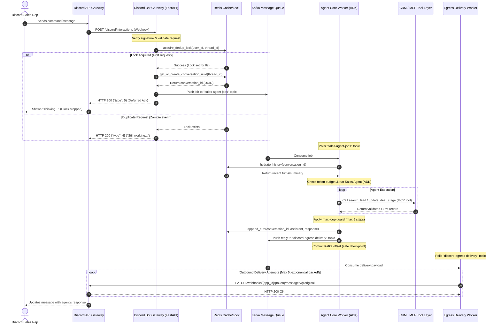

# Discord Sales Agent Workflow

This document describes the decoupled, asynchronous architecture of the Discord Sales Agent Stack. The system is designed to handle slow AI agent reasoning processes (taking 10+ seconds) while adhering to Discord's strict 3-second webhook response window.

---

## Component Architecture

```
                                      [ Discord Client ]
                                              │
                                              │ 1. Interaction (Slash Command)
                                              ▼
                                 [ Discord API Gateway ]
                                              │
                                              │ 2. Webhook Event (3s SLA)
                                              ▼
    ┌─────────────────────────[ Discord Bot Gateway Service ]
    │                             (bot_gateway_service.py)
    │                                   │          │
    │ 3. Check Lock / Map Snowflake     │          │ 4. Immediate Ack ("Thinking...")
    ▼                                   │          ▼
[ Redis Cache / Lock ]                  │   [ Discord API Gateway ]
  - lock:user_id:thread_id              │          ▲
  - thread_map:discord_snowflake        ▼          │ 10. Update Message (PATCH)
                                  [ Kafka Queue ]  │
                                    - sales-agent-jobs
                                    - discord-egress-delivery
                                        │          ▲
                                        │ 5. Job   │ 9. Egress Delivery
                                        ▼          │
                                 [ Agent Core Worker ] ── 8. Commit Kafka Offset
                                (agent_core_worker.py)
                                        │
                                        │ 6. Hydrate History / Save Turn
                                        ▼
                             [ Redis Cache / Lock ]
                               - history:conversation_id
                                        │
                                        │ 7. search_lead / update_deal_stage
                                        ▼
                               [ MCP / CRM Tool Layer ]
                                    (mcp_tool.py)
                                        │
                                        ▼
                                 [ CRM System ]
```

### 1. Ingress: Discord Bot Gateway Service (`bot_gateway_service.py`)
- **Signature Verification:** Verifies the cryptographic signature of webhooks at the edge using `PyNaCl`.
- **Deduplication:** Uses atomic Redis `SET NX EX` locks (8-second TTL) to filter out duplicate/zombie events sent by Discord retries.
- **Stable Identity Mapping:** Maps Discord thread snowflakes to stable internal conversation UUIDs using Redis, keeping external IDs decoupled from the CRM data.
- **Asynchronous Hand-off:** Formats the payload, publishes it to the Kafka `sales-agent-jobs` topic, and immediately responds to Discord with a deferred acknowledgment (`type: 5`). This stops the 3-second timeout clock and displays "Thinking..." to the user.

### 2. Message Bus: Kafka
- Decouples API endpoints from computationally heavy LLM inference.
- Implements two topics:
  - `sales-agent-jobs`: Ingress jobs waiting for agent processing.
  - `discord-egress-delivery`: Outbox queue for finished replies waiting to be sent to Discord.

### 3. Agent Processing: Agent Core Worker (`agent_core_worker.py`)
- **History Hydration & Compactor:** Pulls conversation history from Redis. If the history size exceeds a token budget (6,000 tokens), it runs a summary step using a secondary model call to compress older turns, avoiding context window overflows.
- **Core Reasoning (ADK):** Runs the Google ADK Sales Agent using `gemini-2.5-flash` with the registered MCP tools.
- **Max-Loop Protection:** Implements a step-counter loop guard (max 5 steps) to prevent the agent from getting stuck in a tool-execution deadlock. If exceeded, it triggers a clean hand-off response.
- **Egress Hand-off:** Publishes the final output to the `discord-egress-delivery` queue and commits the Kafka offset.

### 4. Integration: MCP / CRM Tool Layer (`mcp_tool.py`)
- **Schema Validation:** Enforces strict Pydantic model schemas at the boundary to catch CRM API drift early.
- **Idempotency:** Generates action-specific idempotency keys using a hash of the conversation ID and request payload. This ensures that duplicate executions of the core worker (e.g. during a pod crash recovery) do not cause double-writes in the CRM.

### 5. Egress: Egress Delivery Worker (`egress_worker.py`)
- Dedicated worker that consumes finished replies from the egress queue and makes the outbound `PATCH` call back to Discord.
- Implements exponential backoff retry logic to handle Discord rate-limits and temporary network issues without blocking the main agent worker.
- Automatically splits messages that exceed Discord's 2000-character limit, attaching the full response as a markdown file.

---

## Sequence Diagram

The following diagram illustrates the lifecycle of a single interaction:


