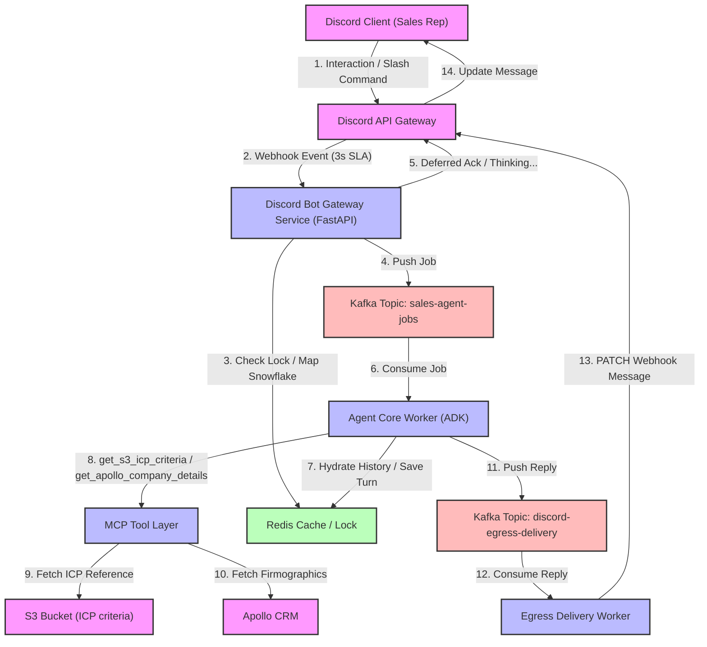
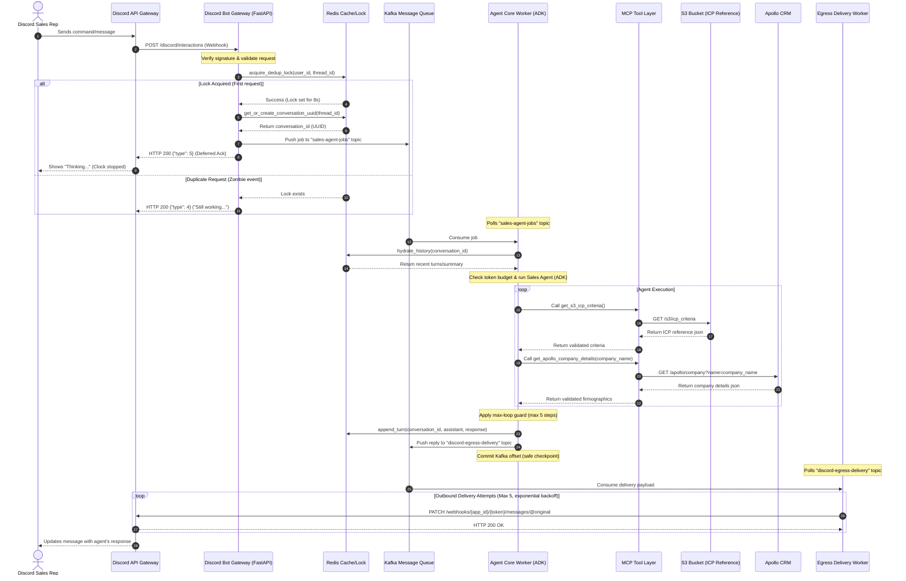

# Discord Sales Agent Workflow

## Elevator Pitch
> [!NOTE]
> It is an asynchronous B2B sales automation stack that allows sales representatives to evaluate target companies against their Ideal Customer Profile (ICP) directly inside Discord. The entire system is built around a core architectural constraint: **Discord webhooks expect a response within 3-seconds, but an AI agent performing real tool-use and multi-step reasoning can take 10 seconds or more.** This system solves that latency mismatch through a fully decoupled, queue-driven event-loop architecture.

### The Lifecycle Flow
1. **Trigger:** A representative sends a message or clicks an interaction button in Discord. This hits Discord's gateway infrastructure first, which forwards the request to our API gateway as a signed cryptographic webhook.
2. **Ingress & Instant Ack:** A lightweight ingress service (FastAPI Bot Gateway) verifies the request signature, maps Discord snowflake IDs to a stable internal conversation UUID, checks a Redis lock to deduplicate double-clicks, and publishes the standardized job payload to Kafka. It immediately returns a deferred channel response (`type: 5` aka "Thinking...") to Discord within milliseconds, stopping the 3-second clock.
3. **Queue & Background Worker:** A decoupled Agent Core Worker process consumes the job from Kafka whenever it has capacity. It pulls the recent conversation history from Redis, applying a token-budget compactor that replaces older turns with a dense summary rather than feeding the model an ever-growing history that eventually overflows the context window.
4. **ICP Evaluation & Safety:** The worker runs the Google ADK Sales Agent. When the agent uses MCP tools to pull ICP criteria from an S3 bucket and fetch firmographics from Apollo CRM, the outputs are schema-validated at the boundary to prevent database changes from silently corrupting the agent's context. Outbound requests include robust mock/fallback fallbacks to guarantee uptime even if external systems are unreachable. A step-count loop guard halts the agent after 5 steps to trigger a clean human hand-off rather than looping forever in a semantic deadlock.
5. **Egress Delivery:** The finished reply is published to a dedicated egress Kafka topic. An independent Egress Delivery Worker consumes the payload and sends it back to Discord using retries with exponential backoff (so Discord API rate-limits/outages never hang the agent process). If the message exceeds Discord's 2000-character limit, it splits the text at the nearest paragraph boundary and attaches the full text as a markdown file.

---

### 1. Ingress: Discord Bot Gateway Service (`bot_gateway_service.py`)
- **Signature Verification:** Verifies the cryptographic signature of webhooks at the edge using `PyNaCl`.
- **Deduplication:** Uses atomic Redis `SET NX EX` locks (8-second TTL) to filter out duplicate/zombie events sent by Discord retries.
- **Stable Identity Mapping:** Maps Discord thread snowflakes to stable internal conversation UUIDs using Redis, keeping external IDs decoupled from the CRM data.
- **Asynchronous Hand-off:** Formats the payload, publishes it to the Kafka `sales-agent-jobs` topic, and immediately responds to Discord with a deferred acknowledgment (`type: 5`). This stops the 3-second timeout clock and displays "Thinking..." to the user.

### 2. Message Bus: Kafka
- Decouples API endpoints from computationally heavy LLM inference.
- Implements two topics:
  - `sales-agent-jobs`: Ingress jobs waiting for agent processing.
  - `discord-egress-delivery`: Outbox queue for finished replies waiting to be sent to Discord.

### 3. Agent Processing: Agent Core Worker (`agent_core_worker.py`)
- **History Hydration & Compactor:** Pulls conversation history from Redis. If the history size exceeds a token budget (6,000 tokens), it runs a summary step using a secondary model call to compress older turns, avoiding context window overflows.
- **Core Reasoning (ADK):** Runs the Google ADK Sales Agent using `gemini-2.5-flash` with the registered MCP tools.
- **Max-Loop Protection:** Implements a step-counter loop guard (max 5 steps) to prevent the agent from getting stuck in a tool-execution deadlock. If exceeded, it triggers a clean hand-off response.
- **Egress Hand-off:** Publishes the final output to the `discord-egress-delivery` queue and commits the Kafka offset.

### 4. Integration: MCP Tool Layer (`mcp_tool.py`)
- **Schema Validation:** Enforces strict Pydantic model schemas at the boundary to catch CRM / S3 format changes and API drift early.
- **Fail-Safe Fallbacks:** Includes local default criteria and firmographic mock data so the agent remains functional even if S3 or Apollo CRM experiences downtime.

### 5. Egress: Egress Delivery Worker (`egress_worker.py`)
- Dedicated worker that consumes finished replies from the egress queue and makes the outbound `PATCH` call back to Discord.
- Implements exponential backoff retry logic to handle Discord rate-limits and temporary network issues without blocking the main agent worker.
- Automatically splits messages that exceed Discord's 2000-character limit, attaching the full response as a markdown file.

---

## Sequence Diagram

The following diagram illustrates the lifecycle of a single interaction:

